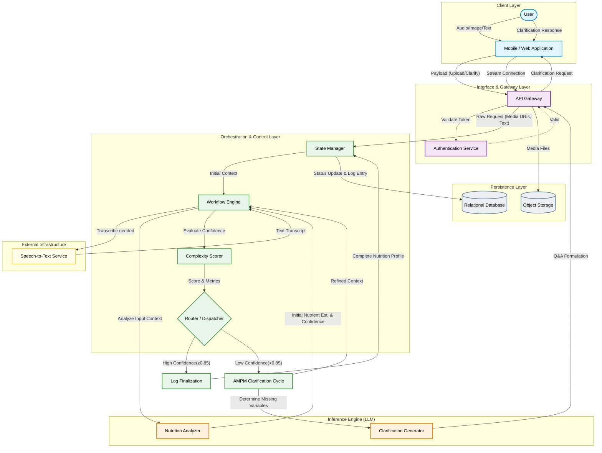

# Reference Architecture for Design Science Research

This reference architecture is an abstract, academic-oriented blueprint of the Snap and Say dietary logging system. It focuses on the functional layers and data flow rather than specific implementations, mapping to the key components of the dynamic complexity scoring and routing mechanism.

## Layer Descriptions (Academic Abstraction)

1.  **Client Layer:** The primary touchpoint for the end-user, handling multimodal inputs (voice, text, image) and displaying real-time streaming feedback and clarification prompts.
2.  **Interface & Gateway Layer:** Manages authentication, session validation, and exposes defining entry points (e.g., RESTful endpoints or Server-Sent Events for streaming).
3.  **Orchestration & Control Layer:** The core state machine and workflow engine. This layer abstracts the stateful agent graph (`langgraph`), including the critical **Complexity Scorer** and **Router**. It evaluates the output of the inference engine against predefined heuristics (e.g., confidence thresholds) to dynamically route the request for immediate logging or multi-turn clarification.
4.  **Inference Engine (Reasoning Layer):** Encapsulates the Large Language Model interactions. It performs the non-deterministic semantic analysis, extracting nutritional entities from the inputs, and generates context-aware clarification questions when triggered by the orchestrator.
5.  **Persistence Layer:** Represents the durable storage of system state, user activity logs (Relational DB), and the raw multimodal artifacts (Object Storage).
6.  **External Infrastructure:** Specialized microservices or third-party APIs relied upon for isolated, specific tasks, such as Speech-to-Text transcription.
