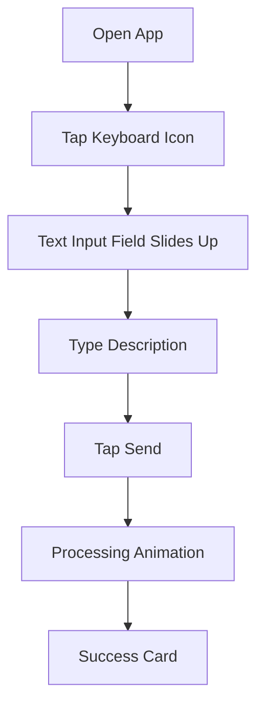
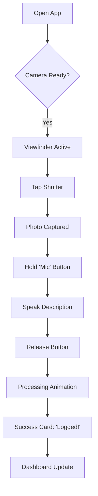
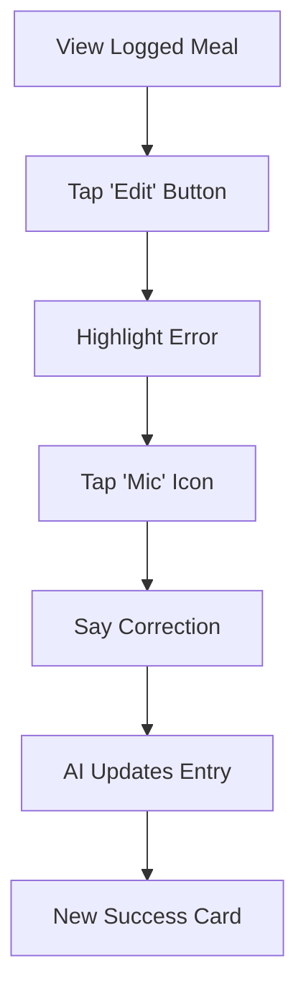

# UX Design Specification snapandsay

**Author:** Fabian
**Date:** 2025-12-04

---

<!-- UX design content will be appended sequentially through collaborative workflow steps -->

## Executive Summary

### Project Vision

Snap and Say is a conversational dietary assessment tool designed for older adults (65+) managing chronic conditions. It bridges the "Friction-Fidelity Trade-off" by using **Agentic AI** to enable voice-first, conversational logging. Unlike passive tracking apps, the system actively reasons about missing details and asks clarifying questions (e.g., "I can't see the dressing") to ensure medical-grade data fidelity without burdening the user.

### Target Users

-   **Martha (The "Casual" User)**: 72, lives alone. Wants to maintain independence. Needs a "zero-friction" experience (no typing, simple UI).
-   **Robert (The "Medical" User)**: 68, Type 2 Diabetic. Needs precision and control over his data.
-   **Dr. Chen (The Clinician)**: Needs accurate, longitudinal data to adjust care plans.

### Key Design Challenges

-   **Accessibility for Seniors**: The interface must be extremely high-contrast, with large touch targets (60x60px) and support for dynamic type. It must be usable by someone with arthritis or poor vision.
-   **Trust & Clarity**: The AI's clarifying questions must feel helpful ("like a friend"), not interrogating. The user must feel in control and able to correct the AI easily.
-   **"Cold Start" & Onboarding**: The system needs to be useful immediately without a complex setup or "training" phase.

### Design Opportunities

-   **"Probabilistic Silence"**: The agent's ability to *not* ask questions when it's confident is a key delighter. Visualizing this "smart silence" could be powerful.
-   **Conversational UI**: Moving away from rigid forms to a fluid chat interface allows for a more natural, human-like interaction.
-   **Adaptive Memory**: Visualizing how the system "learns" user habits (e.g., "I know you usually have toast") can build trust and engagement.

## Core User Experience

### Defining Experience

The core experience of Snap and Say is **"The 30-Second Handoff"**. The user's responsibility ends the moment they capture the data (Snap & Say). The system's responsibility begins immediately after, handling all structuring, analysis, and verification. This inversion of burden—from user to agent—is the defining characteristic. The experience is **Voice-First**, treating the interface as a conversational partner rather than a data entry form.

### Platform Strategy

-   **Primary Platform**: Mobile Web Application (PWA) optimized for iOS Safari and Chrome Android.
-   **Device Capabilities**: Heavy reliance on **MediaRecorder API** for simultaneous voice/image capture.
-   **Offline Strategy**: "Graceful Queuing". The app must function fully offline for capture, syncing silently when connectivity returns.
-   **Accessibility First**: The platform UI is built *specifically* for the 65+ demographic (High Contrast, 60px+ Touch Targets, Dynamic Type support).

### Effortless Interactions

-   **"Snap, Say, Done"**: The primary loop requires zero navigation. The app opens directly to the capture screen.
-   **Smart Defaults**: The system uses time-of-day and history to pre-fill context (e.g., "It's 8 AM, this is likely Breakfast").
-   **Silent Success**: If the agent understands the input with high confidence (>85%), it logs it without interrupting the user. Silence is a sign of success.

### Critical Success Moments

-   **The "Smart" Question**: When the agent asks a clarification question, it *must* demonstrate context (e.g., "Is this the same soup as yesterday?" vs "What is this?"). This moment builds the "Friend" mental model.
-   **The Correction**: When a user corrects the agent ("Actually, that's tea"), the agent must immediately acknowledge and update without argument. This establishes user control.
-   **The "Thinking" State**: The visual feedback during the agent's processing (streaming tokens) must be engaging enough to hold attention for 3-5 seconds without causing frustration.

### Experience Principles

-   **Burden Inversion**: The computer works harder so the human doesn't have to.
-   **Relationship over Transaction**: Every interaction should feel like a conversation with a care provider, not a database query.
-   **Accessibility is Architecture**: Large text and clear audio are not "settings"; they are the default design constraints.
-   **Transparency in Reasoning**: The user should always know *why* the agent logged something (e.g., "Logged as Coffee because it's 7 AM").

## Desired Emotional Response

### Primary Emotional Goals

-   **Relief (Unburdened)**: The primary emotion should be the *absence* of anxiety. The user shouldn't worry about "doing it right" or "forgetting details". The system carries the cognitive load.
-   **Connection (Supported)**: The user should feel like they have a capable assistant, not a judgmental monitor. The tone is encouraging and collaborative.
-   **Competence (In Control)**: Despite the AI doing the heavy lifting, the user must feel they are the ultimate authority. They correct the AI, not the other way around.

### Emotional Journey Mapping

-   **Onboarding**: *From Anxiety ("I can't use tech") to Relief ("Oh, I just talk?").* The interface must prove its simplicity in the first 10 seconds.
-   **The "Snap"**: *Confidence.* The shutter sound and immediate "thinking" animation confirm capture.
-   **The "Say"**: *Naturalness.* No "start recording" friction; it just listens.
-   **The "Clarification"**: *Partnership.* "I see the soup, but what kind is it?" feels like a conversation, not an error message.
-   **The "Log"**: *Accomplishment.* A subtle, satisfying sound or animation confirming the task is done.

### Micro-Emotions

-   **Delight**: When the agent correctly infers context (e.g., "Logged as Lunch" based on time).
-   **Forgiveness**: If the user makes a mistake, the system says "No problem, I'll fix that," rather than "Error".
-   **Patience**: The "Thinking" state isn't a spinning wheel of death; it's a "listening" pulse that implies active attention.

### Design Implications

-   **Warmth over Efficiency**: Copy should use contractions ("I'll", "You're") and conversational markers ("Got it", "Sounds good").
-   **Visual Softness**: Use rounded corners, soft shadows, and organic shapes to avoid a "clinical" or "database" feel.
-   **Positive Feedback Loops**: Celebrate small wins (logging a meal) with subtle visual rewards (a checkmark that "blooms").

### Emotional Design Principles

-   **The "Grandchild" Persona**: The AI should sound like a helpful, patient grandchild—respectful, clear, and eager to help, but never condescending.
-   **Never Blame the User**: If the AI doesn't understand, it's the AI's fault ("I didn't catch that"), never the user's ("You spoke too softly").
-   **Silence is Golden**: Over-communication creates anxiety. If the system is confident, it should just act.

## UX Pattern Analysis & Inspiration

### Inspiring Products Analysis

-   **WhatsApp**: The gold standard for senior adoption. Why? It removes the "interface" almost entirely. It's just a stream of conversation.
-   **Shazam**: The ultimate "One Action" app. It doesn't ask "What do you want to do?". It assumes you want to identify a song. Snap and Say should assume you want to log food.
-   **Lark (Health Chatbot)**: Good use of empathetic, text-based coaching, but often feels too robotic/scripted. We can improve on this with LLM fluidity.

### Transferable UX Patterns

-   **Conversational Input**: Using chat bubbles for data entry instead of forms.
-   **Optimistic UI**: Showing the "Logged" state immediately while the backend processes, to make it feel instant.
-   **"Thinking" Visuals**: Using a waveform or "typing" dots to show the agent is working, keeping the user engaged during latency.

### Anti-Patterns to Avoid

-   **"Did you mean...?" Lists**: Long dropdowns are death for this demographic.
-   **Hidden Menus**: Hamburger menus hide functionality. Critical actions must be visible.
-   **Technical Jargon**: Never use words like "Syncing", "Database", or "Error 404".

### Design Inspiration Strategy

-   **Adopt**: The "Hold-to-Record" pattern from WhatsApp for voice notes.
-   **Adapt**: The "Thinking" dots from iMessage, but make them "edible" or organic to fit the food theme.
-   **Avoid**: The "Dashboard First" approach of MyFitnessPal. We are "Capture First".

## Design System Foundation

### 1.1 Design System Choice

**Tailwind CSS + Shadcn/UI (Radix Primitives)**

### Rationale for Selection

-   **Accessibility First**: Shadcn/UI is built on Radix UI, which handles keyboard navigation and screen reader support out of the box—critical for our demographic.
-   **"Unstyled" Control**: Unlike Material UI, Shadcn doesn't come with "opinionated" styles we have to fight. We can easily set our base button height to `60px` (Senior-friendly) without breaking the component.
-   **Performance**: Zero runtime overhead (unlike Emotion/Styled-Components), ensuring the app feels snappy on older devices.

### Implementation Approach

-   **Base Tokens**: Define a "Senior" scale for spacing and typography.
    -   `text-base` = 18px (instead of 16px).
    -   `min-h-touch` = 60px.
-   **Color Palette**: A "High Contrast" theme by default.
    -   Primary: Deep Blue/Black (for text).
    -   Background: Off-white (to reduce glare).
    -   Action: Vibrant Orange/Green (for clear affordance).

### Customization Strategy

-   **The "Big Button" Variant**: Create a standard button variant that enforces the 60px height and 18px text size.
-   **The "Card" Container**: A high-padding, soft-shadow card component to frame content clearly for aging eyes.

## 2. Core User Experience

### 2.1 Defining Experience

**"Snap & Say"**: The user takes a photo of their food and simply *tells* the app what it is, just like showing a plate to a friend. No searching databases, no weighing ingredients, no typing.

### 2.2 User Mental Model

-   **Current Model**: "I have to be a scientist." (Weighing, searching, logging calories).
-   **Desired Model**: "I'm just showing you my lunch." (Social, natural, effortless).
-   **Metaphor**: The "Grandchild Helper". Imagine a helpful grandchild sitting next to you. You point at the food, they write it down.

### 2.3 Success Criteria

-   **Speed**: < 5 seconds from "Pocket" to "Done".
-   **Forgiveness**: If the photo is blurry, the voice saves it. If the voice is unclear, the photo saves it.
-   **Confirmation**: A clear, large visual/audio cue that says "Got it (The "Mic Drop" moment).

### 2.4 Novel UX Patterns

-   **Multimodal Redundancy**: Using Voice + Vision not just for data, but for *error correction*. This is a novel application of "Show and Tell" for reliability.
-   **"No-Edit" Default**: We assume the AI is right. We don't ask the user to verify every gram immediately. We let them review later (or never, if trust is high).

### 2.5 Experience Mechanics

1.  **Initiation**: App opens -> Camera is *already* active (or 1 tap away). Large viewfinder.
2.  **Interaction (The "One-Two Punch")**:
    *   **Step 1 (Snap)**: Large white shutter button. Tap. *Haptic click*. Photo captured & displayed immediately.
    *   **Step 2 (Say)**: "Mic" button pulses. User holds to speak: "It's a chicken salad with ranch." Release. *Haptic thud*.
3.  **Feedback**: "Thinking" animation (e.g., a playful food icon bouncing).
4.  **Completion**: Card slides in: "Chicken Salad logged." + Satisfying "Ding".

### 1a. The "Text Entry" Flow (Alternative)

**Goal:** Log a meal silenty using the keyboard.

- **Trigger**: Small, discrete "Keyboard" icon next to the main Mic button.
- **Micro-Copy**: "Type what you ate..." placeholder.
- **Feedback**: Transitions to the same "Thinking" animation as voice.

## Visual Design Foundation

### Color System

**Theme: "High Contrast & Warmth"**
-   **Backgrounds**: `bg-zinc-50` (Off-white) to reduce glare.
-   **Text**: `text-slate-900` (Deep Charcoal) for primary text; `text-slate-700` for secondary.
-   **Primary Brand**: `bg-indigo-600` (Trustworthy Blue) for primary actions.
-   **Feedback**:
    -   Success: `text-emerald-700` / `bg-emerald-100`
    -   Error: `text-red-700` / `bg-red-100` (Always with icon + text)

### Typography System

**Typeface: Inter (Sans-Serif)**
-   **Rationale**: Tall x-height, open counters, distinct character shapes (e.g., 'I' vs 'l').
-   **Scale**:
    -   **Display**: 32px / Bold (Headlines)
    -   **Heading**: 24px / Semibold (Section Titles)
    -   **Body Large**: 20px / Regular (Main reading text)
    -   **Body Default**: 18px / Regular (Interface text)
    -   **Caption**: 16px / Medium (Secondary info - *Minimum size*)

### Spacing & Layout Foundation

**The "Senior Touch" Standard**
-   **Minimum Touch Target**: 60px (height/width).
-   **Base Spacing Unit**: 4px (Tailwind default), but we mostly use multiples of **16px** (4 units).
-   **Container Width**: Max-width 600px (centered) on desktop to maintain readable line lengths.
-   **Touch Zones**: Critical actions (Mic, Camera) are placed in the bottom 30% of the screen for easy reach.

### Accessibility Considerations

-   **Contrast Ratio**: All text must meet **AAA (7:1)** standards, not just AA.
-   **Focus States**: High-visibility focus rings (3px solid blue) for keyboard/switch navigation.
-   **No Reliance on Color**: All status messages (Success/Error) must use Icons + Text, never just color changes.

## Design Direction Decision

### Design Directions Explored

We explored variations ranging from "Dense Dashboard" (too complex) to "Immersive Full Screen" (too disorienting).

### Chosen Direction

**"The Focused Card" (Card-Based UI)**

### Design Rationale

-   **Cognitive Load**: Cards chunk information into digestible pieces. A senior user can focus on one "Card" (one meal) at a time without being overwhelmed by a complex table view.
-   **Touch Targets**: A card is naturally a large touch target. The entire container can be tappable.
-   **Metaphor**: It feels like a stack of polaroids or index cards—a familiar physical object.

### Implementation Approach

-   **Layout**: Single column layout.
-   **Container**: `bg-white` cards with `rounded-xl` and `shadow-sm` on a `bg-zinc-50` background.
-   **Navigation**: Fixed bottom bar with `h-16` (64px) height to accommodate large labels.
-   **Disclaimer**: Banner at the top of the Home/Login screen: "Research Prototype. Not a medical device." (Amber background, black text).

### 2a. Nutritional Detail View

**Goal:** Allow users to see the full breakdown if they want it, without cluttering the main view.

- **Trigger**: Tap on any `FoodEntryCard`.
- **View**: A "Flip Card" animation or simple Modal/Drawer.
- **Content**:
    - **Big Numbers**: Calories, Protein, Carbs, Fat.
    - **Visuals**: Simple colored bars for macros (e.g., Blue for Protein, Green for Carbs).
    - **Close**: Large "Close" button at the bottom.

## User Journey Flows

### 1. The "Snap & Say" Flow (Primary)

**Goal**: Log a meal in under 5 seconds.

### 2. The "Multimodal Correction" Flow (Secondary)

**Goal**: Fix an error without using the keyboard.

### Flow Optimization Principles

-   **"Shoot First, Ask Later"**: We never block the capture flow with questions. We capture the data, *then* process it.
-   **"Voice as Eraser"**: We treat voice not just as input, but as a correction tool. It's easier to say "No, it's coffee" than to delete and re-type.
-   **Progressive Disclosure**: We only show the "Edit" button *after* the success card. We don't clutter the capture screen with edit tools.

## Component Strategy

### Design System Components (Shadcn/UI)

We will use **Shadcn/UI** for all standard interface elements to save time:
-   **Dialogs/Drawers**: For settings and detailed editing.
-   **Toasts**: For system feedback ("Saved", "Network Error").
-   **Forms**: Inputs, checkboxes, and switches for the "Profile" section.
-   **Skeleton**: For loading states.

### Custom Components (The "Experience Layer")

These components are unique to Snap & Say and will be built custom using Tailwind:

#### 1. `VoiceCaptureButton`
-   **Purpose**: The primary interface for "Saying".
-   **Interaction**: Press-and-Hold to record.
-   **States**: Idle (Mic Icon), Listening (Pulsing Animation), Processing (Spinning/Thinking), Success (Checkmark).
-   **Accessibility**: Full screen-reader announcements for state changes ("Listening...", "Stopped listening").

#### 2. `FoodEntryCard`
-   **Purpose**: Displays a logged meal.
-   **Anatomy**: Large Photo (Left/Top) + Transcript (Bold Text) + Calories (Badge).
-   **States**:
    -   *Optimistic*: Shows photo immediately with "Analyzing..." text.
    -   *Confirmed*: Shows final data.
    -   *Edit Mode*: Text becomes an input field (or voice active).

#### 2a. `ClarificationPrompt`
- **Purpose**: Ask the user for missing details.
- **Anatomy**:
    - **Question**: Large, clear text (e.g., "What kind of sandwich?").
    - **Context**: "I saw the bread, but..."
    - **Visual Cue**: Icon changes based on the *type* of question (Architecture D8):
        - **Ingredient**: 🥕 Icon (Orange).
        - **Prep**: 🍳 Icon (Red).
        - **Portion**: 📏 Icon (Blue).
- **Interaction**: Voice response or quick-tap chips (e.g., "Turkey", "Ham").

#### 3. `SeniorBottomNav`
-   **Purpose**: Primary navigation.
-   **Specs**: Height `80px` (Standard is 56px). Labels are `14px` Bold (Standard is 10-12px).
-   **Items**: Home, Log (FAB), History, Profile.

### Implementation Roadmap

**Phase 1: The Core Loop (MVP)**
1.  `VoiceCaptureButton` (Critical for "Say")
2.  `FoodEntryCard` (Critical for "See")
3.  `SeniorBottomNav` (Critical for "Go")

**Phase 2: The Support Structure**
4.  `ProfileForm` (Shadcn)
5.  `DailySummaryChart` (Recharts/Shadcn)

## UX Consistency Patterns

### Button Hierarchy

**Rule**: "One Primary Action Per Screen"
-   **Primary**: `h-14` (56px) Solid Indigo. Full width on mobile. Used for the main "Forward" motion.
-   **Secondary**: `h-14` Outline Slate. Used for "Back" or "Cancel".
-   **Tertiary**: Text Link. Used for "Help" or "Forgot Password".

### Feedback Patterns

**Rule**: "Always Acknowledge Action"
-   **Success**: Top-aligned Toast (Green Icon + Bold Text). Auto-dismiss after 3s.
-   **Error**: Inline message (Red Icon + Text) *below* the failed element. No generic "Something went wrong" alerts.
-   **Empty States**: Never just "No Data". Always "No meals yet. Tap the + to start!" (Education + Action).

### Form Patterns

**Rule**: "Giant Inputs"
-   **Input Height**: `h-14` (56px).
-   **Labels**: Always visible (no floating labels that disappear).
-   **Validation**: Real-time checkmark on the right when valid.

### Navigation Patterns

**Rule**: "Labels over Icons"
-   **Bottom Nav**: Always visible. Active state has a filled icon + bold text. Inactive has outline icon + regular text.
-   **Back Button**: Always top-left. Always labeled "Back" (not just an arrow).

## Responsive Design & Accessibility

### Responsive Strategy

**"Mobile-First, Centered Everywhere"**
-   **Mobile (Primary)**: Full-width layout. Optimized for one-handed use (thumb zone).
-   **Tablet/Desktop**: Centered `max-w-xl` (576px) container. We treat the desktop view as a "High-Fidelity Mobile Emulator". We do *not* create a multi-column dashboard, as it breaks the "Grandchild Helper" mental model.

### Accessibility Strategy (WCAG AAA Target)

**1. Visual Accessibility**
-   **Contrast**: All text > 7:1 contrast ratio (AAA).
-   **Scaling**: Layouts must survive **200% Dynamic Type** scaling. Text wraps, containers expand.
-   **Icons**: All icons must have a `stroke-width` of 2px or higher (no thin lines).

**2. Motor Accessibility**
-   **Touch Targets**: Minimum 60x60px for all interactive elements.
-   **Spacing**: Minimum 16px between any two interactive elements to prevent "fat finger" errors.

**3. Cognitive Accessibility**
-   **Labels**: No "Icon-only" buttons (except obvious ones like 'Close'). All navigation items have text labels.
-   **Timeouts**: No short timeouts. Toasts stay for 6 seconds (or until dismissed).

### Testing Strategy

-   **The "Squint Test"**: Can you identify the primary action while squinting?
-   **The "Thumb Test"**: Can you reach all core actions with one hand on an iPhone Max?
-   **The "Zoom Test"**: Does the UI break when the browser is zoomed to 150%?
